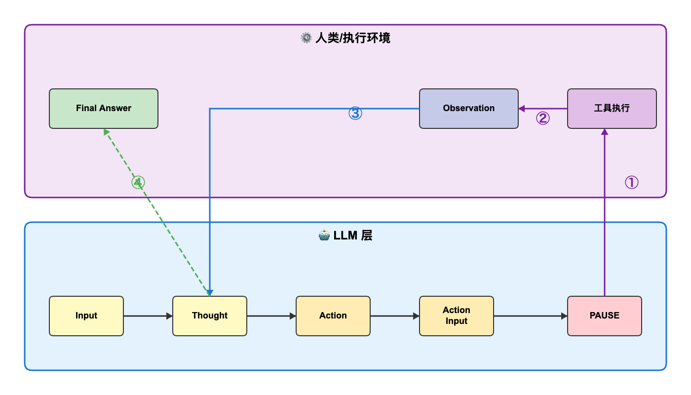
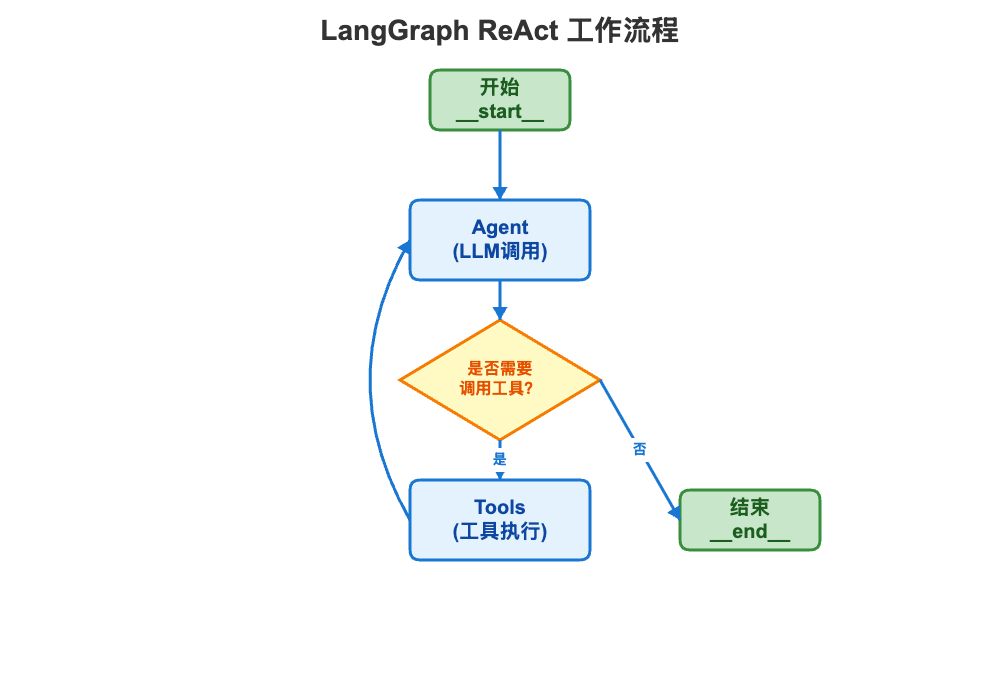

# Agent 设计模式实战指南

## 前言

随着大语言模型（LLM）能力的快速提升，AI Agent 已经从概念走向实践。然而，如何让 Agent 更可靠、更高效地完成复杂任务，成为开发者面临的关键挑战。

就像软件工程中的设计模式为常见问题提供了经过验证的解决方案，Agent 开发同样需要成熟的设计模式来指导实践。不同的任务场景需要不同的决策机制：有的需要边思考边行动，有的需要提前规划，有的需要自我反思，还有的需要人工介入关键决策。

本文将深入介绍五种核心 Agent 设计模式：**ReAct 模式**（推理与行动结合）、**CodeAct 模式**（代码驱动行动）、**计划模式**（先规划后执行）、**反思模式**（自我评估改进）和**人机协作模式**（关键决策人工介入）。通过理论讲解与实战案例，帮助你快速掌握这些模式的应用场景和实现要点。

## 一、ReAct 模式

### 1.1 什么是 ReAct

ReAct（Reasoning + Acting）是一种将推理（Reasoning）和行动（Acting）相结合的 Agent 设计模式。它的核心思想是让 LLM 在解决问题时，不是一次性给出答案，而是模拟人类的思维过程：**边思考、边行动、边观察结果，然后继续思考**。

这种模式特别适合处理需要外部信息或工具支持的任务。通过将复杂问题分解为多个"思考-行动-观察"的小步骤，Agent 能够逐步逼近最终答案，整个过程更加透明、可控。


### 1.2 ReAct 的工作流程

ReAct 的核心流程可以概括为一个循环：**Thought → Action → Observation → Thought → ...**

#### 流程详解

1. **Thought（思考）**
   - Agent 分析当前问题和已有信息
   - 决定下一步需要做什么
   - 例如："我需要查询青岛啤酒的股票收盘价"

2. **Action（行动）**
   - 选择合适的工具并指定参数
   - 例如：`Action: get_closing_price`
   - 例如：`Action Input: {"name": "青岛啤酒"}`

3. **Observation（观察）**
   - 工具执行后返回结果
   - 将结果反馈给 Agent
   - 例如：`Observation: 67.92`

4. **循环迭代**
   - 如果问题未解决，继续下一轮 Thought-Action-Observation
   - 如果问题已解决，输出 `Final Answer`

#### 流程图示



**流程说明：**
- **LLM 层（蓝色区域）**：接收 Input 后，依次生成 Thought → Action → Action Input → PAUSE
- **执行环境（紫色区域）**：工具执行后生成 Observation，反馈给 LLM
- **循环机制**：Observation 返回到 Thought（标记③），形成闭环，直到 LLM 输出 Final Answer（标记④）


### 1.3 实战案例

#### 案例：比较两个股票的收盘价

**任务：** 请比较青岛啤酒和贵州茅台的股票收盘价谁高？

#### 核心代码实现

**1. 工具定义与注册**

```typescript
// 工具定义（JSON Schema 格式）
const tools = [{
  name: 'get_closing_price',
  description: '使用该工具获取指定股票的收盘价',
  parameters: {
    type: 'object',
    properties: {
      name: { type: 'string', description: '股票名称' }
    },
    required: ['name']
  }
}]

// 工具注册表（工具名 -> 实现函数）
const toolRegistry = {
  get_closing_price: (params) => getClosingPrice(params.name)
}
```

**2. Prompt 模板（关键部分）**

```typescript
const REACT_PROMPT = `
You run in a loop of Thought, Action, Action Input, PAUSE, Observation.
At the end of the loop you output an Answer.

Your available actions are: {tools}

Example:
Question: 今天北京天气怎么样？
Thought: 我需要调用 get_weather 工具获取天气
Action: get_weather
Action Input: {"city": "BeiJing"}
PAUSE

Observation: 北京的气温是0度.
Final Answer: 北京的气温是0度.

New input: {input}`
```

**3. Agent 主循环（核心逻辑）**

```typescript
async function reactAgent(query: string) {
  // 构建初始提示词
  const prompt = REACT_PROMPT
    .replace('{tools}', JSON.stringify(tools))
    .replace('{input}', query)

  const messages = [{ role: 'user', content: prompt }]

  while (true) {
    // 1. 调用 LLM
    const response = await llm.chat(messages)
    const text = response.content

    // 2. 检查是否有最终答案
    if (text.includes('Final Answer:')) {
      return text.match(/Final Answer:\s*(.*)/)[1]
    }

    // 3. 解析 Action 和 Action Input
    const action = text.match(/Action:\s*(\w+)/)?.[1]
    const input = text.match(/Action Input:\s*({.*})/s)?.[1]

    if (!action || !input) break

    // 4. 执行工具
    const params = JSON.parse(input)
    const observation = await toolRegistry[action](params)

    // 5. 将 LLM 响应和 Observation 加入历史
    messages.push(
      { role: 'assistant', content: text },
      { role: 'user', content: `Observation: ${observation}` }
    )
  }
}
```

**关键步骤说明：**
1. 用 Prompt 模板初始化，注入工具列表和用户问题
2. 循环调用 LLM，直到出现 `Final Answer`
3. 解析 LLM 输出的 `Action` 和 `Action Input`
4. 从注册表中找到对应工具并执行
5. 将 Observation 反馈给 LLM，继续下一轮循环

#### 运行结果示例

```
第一轮：
Thought: 我需要获取青岛啤酒的股票收盘价
Action: get_closing_price
Action Input: {"name": "青岛啤酒"}
→ Observation: 67.92

第二轮：
Thought: 现在需要获取贵州茅台的收盘价
Action: get_closing_price
Action Input: {"name": "贵州茅台"}
→ Observation: 1488.21

最终答案：
贵州茅台的股票收盘价（1488.21）比青岛啤酒（67.92）高得多
```

### 1.4 使用 Function Call 来实现

前面展示的是经典的 ReAct 模式实现，需要通过 Prompt 让 LLM 输出特定格式（Thought/Action/Observation），然后手动解析这些文本。而现代 LLM API 都支持 **Function Calling**（函数调用），这让 ReAct 的实现变得更简单、更可靠。


#### 核心代码实现

**1. 工具定义（标准 OpenAI 格式）**

```typescript
import { ChatCompletionTool } from 'openai/resources/chat/completions'

export const tools: ChatCompletionTool[] = [
  {
    type: 'function',
    function: {
      name: 'get_closing_price',
      description: '使用该工具获取指定股票的收盘价',
      parameters: {
        type: 'object',
        properties: {
          name: { 
            type: 'string', 
            description: '股票名称' 
          }
        },
        required: ['name']
      }
    }
  }
]

// 工具注册表
export const toolRegistry: Record<string, (params: any) => string> = {
  get_closing_price: (params) => getClosingPrice(params.name)
}
```

**2. Agent 主循环（Function Call 版本）**

```typescript
async function functionCallAgent(query: string) {
  const messages: ChatCompletionMessageParam[] = [
    { role: 'user', content: query }
  ]

  while (true) {
    // 1. 调用 LLM，传入 tools 配置
    const response = await client.chat.completions.create({
      model: 'gpt-4o',
      messages,
      tools,
      tool_choice: 'auto'  // LLM 自动决定是否调用工具
    })

    const choice = response.choices[0]
    if (!choice?.message) break

    const toolCalls = choice.message.tool_calls

    // 2. 如果没有工具调用，说明已经得到最终答案
    if (!toolCalls || toolCalls.length === 0) {
      console.log('最终答案:', choice.message.content)
      break
    }

    // 3. 执行工具调用
    messages.push(choice.message)  // 保存 LLM 的工具调用请求

    for (const toolCall of toolCalls) {
      if (toolCall.type === 'function') {
        const toolName = toolCall.function.name
        const args = JSON.parse(toolCall.function.arguments)
        const toolFunc = toolRegistry[toolName]

        if (toolFunc) {
          const result = toolFunc(args)
          
          // 4. 将工具执行结果返回给 LLM
          messages.push({
            role: 'tool',
            content: result,
            tool_call_id: toolCall.id
          })
        }
      }
    }
  }
}
```

### 1.5 使用 LangGraph（状态图）实现

对于复杂的 Agent 场景（需要记忆、反思、人工介入等），LangGraph 提供了声明式的图结构定义，更易于维护和扩展。

#### 核心概念

LangGraph 将 Agent 建模为**状态图**：



- **节点（Node）**：执行任务的函数
- **边（Edge）**：节点间的转换规则  
- **状态（State）**：在节点间传递的数据

#### 核心代码

**构建图：**

```typescript
import { StateGraph, END } from '@langchain/langgraph'
import { Annotation } from '@langchain/langgraph'

// 1. 定义状态
const GraphState = Annotation.Root({
  messages: Annotation<BaseMessage[]>({
    reducer: (x, y) => x.concat(y),
    default: () => []
  })
})

// 2. 定义节点
const llm = new ChatOpenAI({ model: 'gpt-4o' }).bindTools(tools)

async function callModel(state: typeof GraphState.State) {
  const response = await llm.invoke(state.messages)
  return { messages: [response] }
}

async function callTools(state: typeof GraphState.State) {
  const lastMessage = state.messages[state.messages.length - 1]
  const toolMessages = await Promise.all(
    lastMessage.tool_calls.map(async (tc) => {
      const tool = tools.find(t => t.name === tc.name)
      const result = await tool.invoke(tc.args)
      return new ToolMessage({ content: String(result), tool_call_id: tc.id })
    })
  )
  return { messages: toolMessages }
}

// 3. 路由函数
function shouldContinue(state: typeof GraphState.State) {
  const lastMessage = state.messages[state.messages.length - 1]
  return lastMessage.tool_calls?.length > 0 ? 'tools' : END
}

// 4. 构建图
function buildGraph() {
  return new StateGraph(GraphState)
    .addNode('agent', callModel)
    .addNode('tools', callTools)
    .addEdge('__start__', 'agent')
    .addConditionalEdges('agent', shouldContinue)
    .addEdge('tools', 'agent')
    .compile()
}

// 5. 运行
const app = buildGraph()
await app.invoke({ messages: [new HumanMessage('问题')] })
```

其实 `@langchain/langgraph` 提供了 `createReactAgent`，可以更加方便的实现类似功能：

```typescript
import { createReactAgent } from '@langchain/langgraph/prebuilt'
import { ChatOpenAI } from '@langchain/openai'
import { tool } from '@langchain/core/tools'
import { z } from 'zod'

// 定义工具
const getClosingPriceTool = tool(
  (input) => {
    const name = (input as { name: string }).name
    if (name === '青岛啤酒') return '67.92'
    if (name === '贵州茅台') return '1488.21'
    return '未搜到该股票'
  },
  {
    name: 'get_closing_price',
    description: '获取指定股票的收盘价',
    schema: z.object({ name: z.string().describe('股票名称') })
  }
)

// 创建 Agent（一行代码）
const agent = createReactAgent({
  llm: new ChatOpenAI({ model: 'gpt-4o' }),
  tools: [getClosingPriceTool]
})

// 运行
const result = await agent.invoke({
  messages: [{ role: 'user', content: '比较青岛啤酒和贵州茅台的收盘价' }]
})
```
---

## 二、CodeAct 模式

### 2.1 CodeAct 的核心理念
- 用代码作为统一的行动接口
- 与 ReAct 的区别

### 2.2 工作机制
- 代码生成流程
- 代码执行环境
- 结果反馈机制

### 2.3 优势与局限
- 灵活性优势
- 安全性考虑
- 性能权衡

### 2.4 实现架构
- LLM 代码生成层
- 沙箱执行环境
- 工具函数库设计

### 2.5 实战案例
- 典型应用场景
- 代码实现细节
- 最佳实践

---

## 三、计划模式（Plan Mode）

### 3.1 计划模式概述
- "先计划，后执行"的思想
- Plan-and-Execute 框架

### 3.2 两种计划模式实现

#### 3.2.1 简单计划模式
- 一次性规划
- 顺序执行
- 适用场景

#### 3.2.2 高级计划模式
- 动态调整计划
- 并行任务处理
- 计划重新评估机制

### 3.3 计划生成策略
- 任务分解技术
- 依赖关系处理
- 优先级排序

### 3.4 执行与监控
- 执行进度跟踪
- 异常处理
- 结果汇总

### 3.5 实战案例
- 复杂任务规划示例
- 对比简单模式与高级模式

---

## 四、反思模式（Reflection Mode）

### 4.1 反思模式的价值
- 自我评估与改进
- 提升输出质量
- 减少错误

### 4.2 工作原理
- 初始输出生成
- 自我批评分析
- 迭代改进
- 终止条件

### 4.3 反思策略
- 质量评估维度
- 反思 Prompt 设计
- 改进建议生成

### 4.4 实现技巧
- 避免无限循环
- 平衡质量与效率
- 反思深度控制

### 4.5 实战案例
- 内容生成场景
- 代码优化场景
- 效果对比分析

---

## 五、人机协作模式（Human-in-the-Loop）

### 5.1 为什么需要人机协作
- Agent 的局限性
- 关键决策的人工介入
- 风险控制

### 5.2 协作时机
- 不确定性判断
- 敏感操作确认
- 策略选择
- 异常处理

### 5.3 交互设计
- 中断机制
- 输入接口设计
- 反馈展示
- 恢复执行

### 5.4 实现模式
- 同步交互
- 异步交互
- 批准工作流

### 5.5 实战案例
- 文件操作确认
- 数据分析决策
- 多方案选择

---

## 六、模式对比与选择

### 6.1 五种模式对比表
- 复杂度
- 适用场景
- 优缺点
- 实现成本

### 6.2 选择决策树
- 根据任务特征选择
- 根据可靠性要求选择
- 根据交互需求选择

### 6.3 混合使用
- 模式组合策略
- 优势互补
- 实际案例

---

## 七、工程实践建议

### 7.1 Prompt 工程
- 通用技巧
- 针对不同模式的优化

### 7.2 错误处理
- 常见错误类型
- 容错机制
- 降级策略

### 7.3 性能优化
- Token 使用优化
- 响应时间优化
- 成本控制

### 7.4 测试与评估
- 测试用例设计
- 效果评估指标
- 持续改进

---

## 八、未来展望

### 8.1 设计模式的演进
- 新兴模式
- 技术趋势

### 8.2 工具生态
- 框架与平台
- 开发工具

### 8.3 最佳实践的沉淀
- 行业标准
- 社区贡献

---

## 附录

### A. 完整代码示例
- Python 实现
- TypeScript/JavaScript 实现

### B. 参考资源
- 论文列表
- 开源项目
- 学习资料

### C. 术语表
- 关键概念解释
- 缩写说明

---

## 总结
- 五种模式的核心价值
- 实战应用建议
- 持续学习路径

