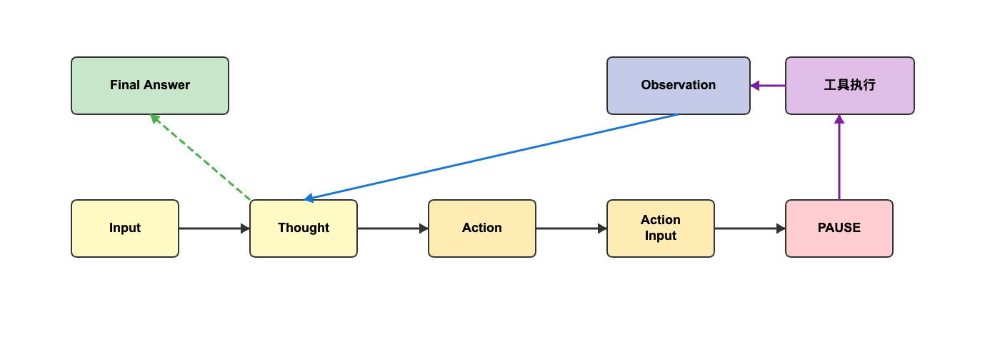
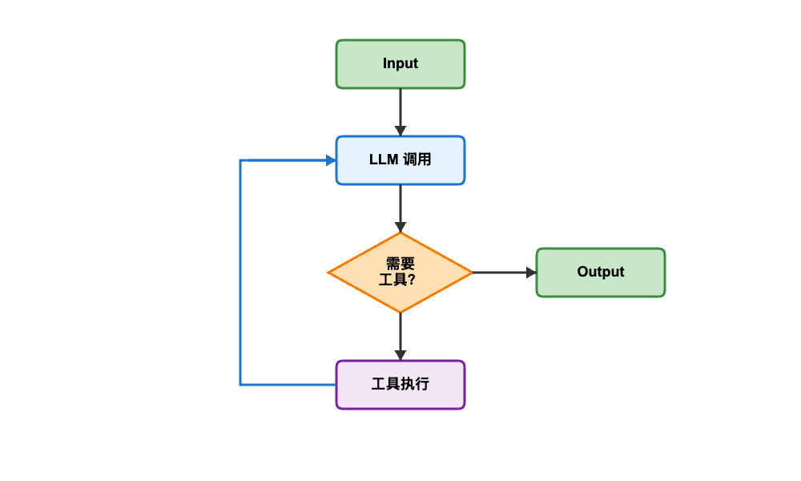
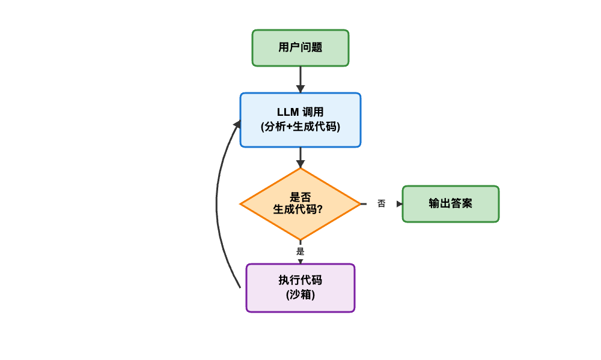
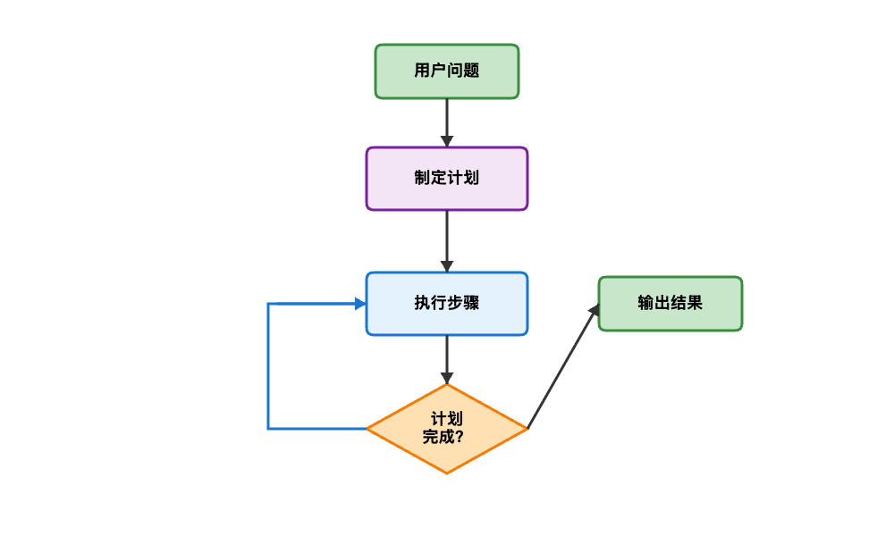
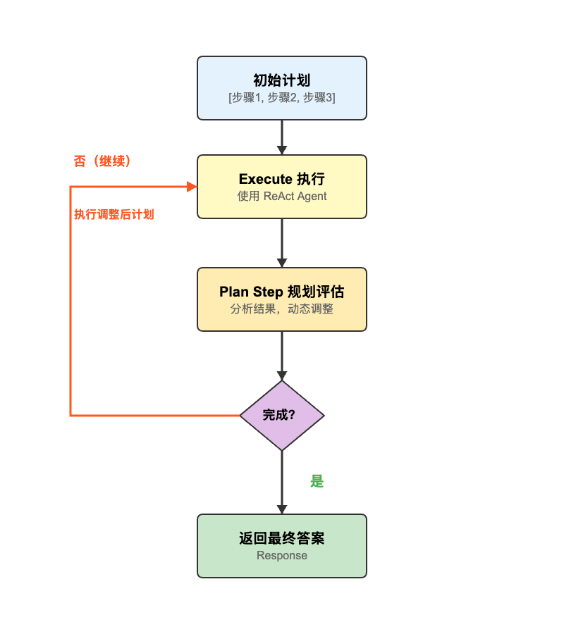
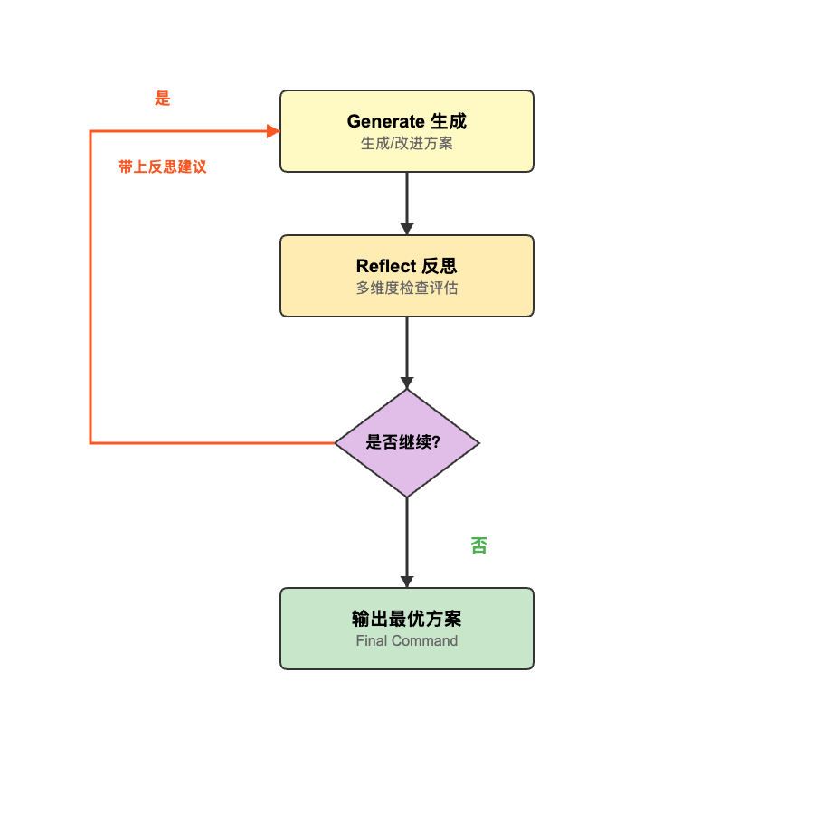

# Agent 设计模式实战指南

## 前言

随着大语言模型（LLM）能力的快速提升，AI Agent 已经从概念走向实践。然而，如何让 Agent 更可靠、更高效地完成复杂任务，成为开发者面临的关键挑战。

就像软件工程中的设计模式为常见问题提供了经过验证的解决方案，Agent 开发同样需要成熟的设计模式来指导实践。不同的任务场景需要不同的决策机制：有的需要边思考边行动，有的需要提前规划，有的需要自我反思，还有的需要人工介入关键决策。

本文将深入介绍五种核心 Agent 设计模式：**ReAct 模式**（推理与行动结合）、**CodeAct 模式**（代码驱动行动）、**计划模式**（先规划后执行）、**反思模式**（自我评估改进）和**人机协作模式**（关键决策人工介入）。通过理论讲解与实战案例，帮助你快速掌握这些模式的应用场景和实现要点。

## 一、ReAct 模式

### 1.1 什么是 ReAct

ReAct（Reasoning + Acting）是一种将推理（Reasoning）和行动（Acting）相结合的 Agent 设计模式。它的核心思想是让 LLM 在解决问题时，不是一次性给出答案，而是模拟人类的思维过程：**边思考、边行动、边观察结果，然后继续思考**。

这种模式特别适合处理需要外部信息或工具支持的任务。通过将复杂问题分解为多个"思考-行动-观察"的小步骤，Agent 能够逐步逼近最终答案，整个过程更加透明、可控。


### 1.2 ReAct 的工作流程

ReAct 的核心流程可以概括为一个循环：**Thought → Action → Observation → Thought → ...**

#### 流程详解

1. **Thought（思考）**
   - Agent 分析当前问题和已有信息
   - 决定下一步需要做什么
   - 例如："我需要查询青岛啤酒的股票收盘价"

2. **Action（行动）**
   - 选择合适的工具并指定参数
   - 例如：`Action: get_closing_price`
   - 例如：`Action Input: {"name": "青岛啤酒"}`

3. **Observation（观察）**
   - 工具执行后返回结果
   - 将结果反馈给 Agent
   - 例如：`Observation: 67.92`

4. **循环迭代**
   - 如果问题未解决，继续下一轮 Thought-Action-Observation
   - 如果问题已解决，输出 `Final Answer`

#### 流程图示



**流程说明：**
- **LLM 层（蓝色区域）**：接收 Input 后，依次生成 Thought → Action → Action Input → PAUSE
- **执行环境（紫色区域）**：工具执行后生成 Observation，反馈给 LLM
- **循环机制**：Observation 返回到 Thought（标记③），形成闭环，直到 LLM 输出 Final Answer（标记④）


### 1.3 实战案例

#### 案例：比较两个股票的收盘价

**任务：** 请比较青岛啤酒和贵州茅台的股票收盘价谁高？

#### 核心代码实现

**1. 工具定义与注册**

```typescript
// 工具定义（JSON Schema 格式）
const tools = [{
  name: 'get_closing_price',
  description: '使用该工具获取指定股票的收盘价',
  parameters: {
    type: 'object',
    properties: {
      name: { type: 'string', description: '股票名称' }
    },
    required: ['name']
  }
}]

// 工具注册表（工具名 -> 实现函数）
const toolRegistry = {
  get_closing_price: (params) => getClosingPrice(params.name)
}
```

**2. Prompt 模板（关键部分）**

```typescript
const REACT_PROMPT = `
You run in a loop of Thought, Action, Action Input, PAUSE, Observation.
At the end of the loop you output an Answer.

Your available actions are: {tools}

Example:
Question: 今天北京天气怎么样？
Thought: 我需要调用 get_weather 工具获取天气
Action: get_weather
Action Input: {"city": "BeiJing"}
PAUSE

Observation: 北京的气温是0度.
Final Answer: 北京的气温是0度.

New input: {input}`
```

**3. Agent 主循环（核心逻辑）**

```typescript
async function reactAgent(query: string) {
  // 构建初始提示词
  const prompt = REACT_PROMPT
    .replace('{tools}', JSON.stringify(tools))
    .replace('{input}', query)

  const messages = [{ role: 'user', content: prompt }]

  while (true) {
    // 1. 调用 LLM
    const response = await llm.chat(messages)
    const text = response.content

    // 2. 检查是否有最终答案
    if (text.includes('Final Answer:')) {
      return text.match(/Final Answer:\s*(.*)/)[1]
    }

    // 3. 解析 Action 和 Action Input
    const action = text.match(/Action:\s*(\w+)/)?.[1]
    const input = text.match(/Action Input:\s*({.*})/s)?.[1]

    if (!action || !input) break

    // 4. 执行工具
    const params = JSON.parse(input)
    const observation = await toolRegistry[action](params)

    // 5. 将 LLM 响应和 Observation 加入历史
    messages.push(
      { role: 'assistant', content: text },
      { role: 'user', content: `Observation: ${observation}` }
    )
  }
}
```

**关键步骤说明：**
1. 用 Prompt 模板初始化，注入工具列表和用户问题
2. 循环调用 LLM，直到出现 `Final Answer`
3. 解析 LLM 输出的 `Action` 和 `Action Input`
4. 从注册表中找到对应工具并执行
5. 将 Observation 反馈给 LLM，继续下一轮循环

#### 运行结果示例

```
第一轮：
Thought: 我需要获取青岛啤酒的股票收盘价
Action: get_closing_price
Action Input: {"name": "青岛啤酒"}
→ Observation: 67.92

第二轮：
Thought: 现在需要获取贵州茅台的收盘价
Action: get_closing_price
Action Input: {"name": "贵州茅台"}
→ Observation: 1488.21

最终答案：
贵州茅台的股票收盘价（1488.21）比青岛啤酒（67.92）高得多
```

### 1.4 使用 Function Call 来实现

前面展示的是经典的 ReAct 模式实现，需要通过 Prompt 让 LLM 输出特定格式（Thought/Action/Observation），然后手动解析这些文本。而现代 LLM API 都支持 **Function Calling**（函数调用），这让 ReAct 的实现变得更简单、更可靠。


#### 核心代码实现

**1. 工具定义（标准 OpenAI 格式）**

```typescript
import { ChatCompletionTool } from 'openai/resources/chat/completions'

export const tools: ChatCompletionTool[] = [
  {
    type: 'function',
    function: {
      name: 'get_closing_price',
      description: '使用该工具获取指定股票的收盘价',
      parameters: {
        type: 'object',
        properties: {
          name: { 
            type: 'string', 
            description: '股票名称' 
          }
        },
        required: ['name']
      }
    }
  }
]

// 工具注册表
export const toolRegistry: Record<string, (params: any) => string> = {
  get_closing_price: (params) => getClosingPrice(params.name)
}
```

**2. Agent 主循环（Function Call 版本）**

```typescript
async function functionCallAgent(query: string) {
  const messages: ChatCompletionMessageParam[] = [
    { role: 'user', content: query }
  ]

  while (true) {
    // 1. 调用 LLM，传入 tools 配置
    const response = await client.chat.completions.create({
      model: 'gpt-4o',
      messages,
      tools,
      tool_choice: 'auto'  // LLM 自动决定是否调用工具
    })

    const choice = response.choices[0]
    if (!choice?.message) break

    const toolCalls = choice.message.tool_calls

    // 2. 如果没有工具调用，说明已经得到最终答案
    if (!toolCalls || toolCalls.length === 0) {
      console.log('最终答案:', choice.message.content)
      break
    }

    // 3. 执行工具调用
    messages.push(choice.message)  // 保存 LLM 的工具调用请求

    for (const toolCall of toolCalls) {
      if (toolCall.type === 'function') {
        const toolName = toolCall.function.name
        const args = JSON.parse(toolCall.function.arguments)
        const toolFunc = toolRegistry[toolName]

        if (toolFunc) {
          const result = toolFunc(args)
          
          // 4. 将工具执行结果返回给 LLM
          messages.push({
            role: 'tool',
            content: result,
            tool_call_id: toolCall.id
          })
        }
      }
    }
  }
}
```

### 1.5 使用 LangGraph（状态图）实现

对于复杂的 Agent 场景（需要记忆、反思、人工介入等），LangGraph 提供了声明式的图结构定义，更易于维护和扩展。

#### 核心概念

LangGraph 将 Agent 建模为**状态图**：



- **节点（Node）**：执行任务的函数
- **边（Edge）**：节点间的转换规则  
- **状态（State）**：在节点间传递的数据

#### 核心代码

**构建图：**

```typescript
import { StateGraph, END } from '@langchain/langgraph'
import { Annotation } from '@langchain/langgraph'

// 1. 定义状态
const GraphState = Annotation.Root({
  messages: Annotation<BaseMessage[]>({
    reducer: (x, y) => x.concat(y),
    default: () => []
  })
})

// 2. 定义节点
const llm = new ChatOpenAI({ model: 'gpt-4o' }).bindTools(tools)

async function callModel(state: typeof GraphState.State) {
  const response = await llm.invoke(state.messages)
  return { messages: [response] }
}

async function callTools(state: typeof GraphState.State) {
  const lastMessage = state.messages[state.messages.length - 1]
  const toolMessages = await Promise.all(
    lastMessage.tool_calls.map(async (tc) => {
      const tool = tools.find(t => t.name === tc.name)
      const result = await tool.invoke(tc.args)
      return new ToolMessage({ content: String(result), tool_call_id: tc.id })
    })
  )
  return { messages: toolMessages }
}

// 3. 路由函数
function shouldContinue(state: typeof GraphState.State) {
  const lastMessage = state.messages[state.messages.length - 1]
  return lastMessage.tool_calls?.length > 0 ? 'tools' : END
}

// 4. 构建图
function buildGraph() {
  return new StateGraph(GraphState)
    .addNode('agent', callModel)
    .addNode('tools', callTools)
    .addEdge('__start__', 'agent')
    .addConditionalEdges('agent', shouldContinue)
    .addEdge('tools', 'agent')
    .compile()
}

// 5. 运行
const app = buildGraph()
await app.invoke({ messages: [new HumanMessage('问题')] })
```

其实 `@langchain/langgraph` 提供了 `createReactAgent`，可以更加方便的实现类似功能：

```typescript
import { createReactAgent } from '@langchain/langgraph/prebuilt'
import { ChatOpenAI } from '@langchain/openai'
import { tool } from '@langchain/core/tools'
import { z } from 'zod'

// 定义工具
const getClosingPriceTool = tool(
  (input) => {
    const name = (input as { name: string }).name
    if (name === '青岛啤酒') return '67.92'
    if (name === '贵州茅台') return '1488.21'
    return '未搜到该股票'
  },
  {
    name: 'get_closing_price',
    description: '获取指定股票的收盘价',
    schema: z.object({ name: z.string().describe('股票名称') })
  }
)

// 创建 Agent（一行代码）
const agent = createReactAgent({
  llm: new ChatOpenAI({ model: 'gpt-4o' }),
  tools: [getClosingPriceTool]
})

// 运行
const result = await agent.invoke({
  messages: [{ role: 'user', content: '比较青岛啤酒和贵州茅台的收盘价' }]
})
```
---

## 二、CodeAct 模式

### 2.1 核心理念

**CodeAct = Code as Action**（代码即行动）

与 ReAct 模式的关键区别：
- **ReAct**：调用预定义工具（如 `get_closing_price('青岛啤酒')`）
- **CodeAct**：生成并执行代码来完成任务

```
ReAct:  Thought → Action(tool_name, args) → Observation
CodeAct: Thought → Code Generation → Code Execution → Observation
```

### 2.2 工作流程



1. **LLM 分析**：理解用户问题
2. **生成代码**：编写 Python/JavaScript 代码
3. **执行代码**：在沙箱环境中运行
4. **结果反馈**：将执行结果返回给 LLM
5. **循环或结束**：根据结果决定是否继续

### 2.3 实战案例

**需求：** 计算 1~100 的和

#### 核心代码

**1. 提示词（Prompt）**

```typescript
// prompts.ts
export const SYSTEM_PROMPT = `你是一个能够编写和执行代码的智能助手。
当用户提出问题时，你需要：
1. 分析问题并确定需要编写什么代码
2. 编写能解决问题的 JavaScript 代码
3. 代码必须将最终结果存储在 'result' 变量中
4. 将代码包裹在 \`\`\`javascript 代码块中
5. 分析执行结果，如果有错误则修改代码再次执行
6. 最终给用户提供答案`
```

**2. 工具（代码执行器）**

```typescript
// tools.ts
import { z } from 'zod'
import { tool } from '@langchain/core/tools'
import vm from 'vm'

export const executePythonTool = tool(
  (input) => {
    const code = (input as { code: string }).code
    try {
      console.log('执行代码:\n', code)
      
      // 使用 vm 创建沙箱环境
      const context = { result: undefined, console }
      vm.createContext(context)
      vm.runInContext(code, context, { timeout: 5000 })
      
      const result = context.result ?? '执行成功'
      console.log('执行结果:\n', result)
      return String(result)
    } catch (error: any) {
      return `代码执行错误: ${error.message}`
    }
  },
  {
    name: 'execute_javascript',
    description: '执行 JavaScript 代码并返回结果',
    schema: z.object({
      code: z.string().describe('要执行的 JavaScript 代码')
    })
  }
)
```

**3. Agent 逻辑（LangGraph）**

```typescript
// graph.ts
import { StateGraph, END } from '@langchain/langgraph'
import { Annotation } from '@langchain/langgraph'
import { ChatOpenAI } from '@langchain/openai'
import { AIMessage, HumanMessage, SystemMessage } from '@langchain/core/messages'
import { SYSTEM_PROMPT } from './prompts'
import { executePythonTool } from './tools'

// 定义状态
const CodeActState = Annotation.Root({
  messages: Annotation<any[]>({
    reducer: (x, y) => x.concat(y),
    default: () => []
  }),
  output: Annotation<string>({ default: () => '' }),
  userPrompt: Annotation<string>({ default: () => '' })
})

const llm = new ChatOpenAI({ model: 'gpt-4o' })

// 提取代码
function extractCode(content: string) {
  if (content.includes('```javascript')) {
    const blocks = content.split('```javascript')
    const code = blocks[1].split('```')[0].trim()
    return code
  }
  return null
}

// LLM 节点
async function llmCall(state: typeof CodeActState.State) {
  const messages = [
    new SystemMessage(SYSTEM_PROMPT),
    new HumanMessage(state.userPrompt),
    ...state.messages
  ]
  
  const response = await llm.invoke(messages)
  const code = extractCode(response.content as string)
  
  if (code) {
    return { 
      messages: [response], 
      output: '',
      code 
    }
  }
  
  return { 
    messages: [response], 
    output: response.content 
  }
}

// 路由函数
function shouldExecute(state: typeof CodeActState.State) {
  return state.output ? END : 'executeNode'
}

// 执行节点
async function executeNode(state: typeof CodeActState.State) {
  const code = (state as any).code
  const result = await executePythonTool.invoke({ code })
  
  return {
    messages: [
      new HumanMessage(`## 执行结果:\n${result}`)
    ]
  }
}

// 构建图
export function buildCodeActGraph() {
  return new StateGraph(CodeActState)
    .addNode('llmCall', llmCall)
    .addNode('executeNode', executeNode)
    .addEdge('__start__', 'llmCall')
    .addConditionalEdges('llmCall', shouldExecute)
    .addEdge('executeNode', 'llmCall')
    .compile()
}
```

**4. 运行**

```typescript
const agent = buildCodeActGraph()
const result = await agent.invoke({
  userPrompt: '请计算 1~100 的和'
})
console.log(result.output)
```

#### 运行效果

```
[启动 CodeAct Agent]
[用户问题] 请计算 1~100 的和


[LLM 节点] 分析问题...
[生成代码]

[执行节点] 运行代码...
## 执行代码:
 let n = 100;
let result = (n * (n + 1)) / 2;
result;
## 执行结果:
 执行成功

[LLM 节点] 分析问题...
[直接给出答案]

[完成]

[最终答案]
 很好！结果表明，1 到 100 的和是 5050。您是否还有其他数学问题或需要进一步的帮助？
```

从结果可以看到，大模型并没有使用循环，而是用等差数列求和公式来实现的，有点聪明的样子。

## 三、计划模式（Plan Mode）

### 3.1 核心理念

**Plan Mode = Plan + Execute**（先计划，后执行）

与 ReAct 模式的关键区别：
- **ReAct**：边思考边行动（Think → Act → Observe → Think...）
- **Plan Mode**：先制定完整计划，再按计划执行（Plan → Execute → Execute → ...）

```
ReAct:    每步决策 → 适合探索性任务
Plan:     先规划再执行 → 适合结构化任务
```

**优势：**
- 更清晰的执行路径
- 便于进度监控
- 可预测的资源消耗
- 易于调试和优化

**劣势：**
- 灵活性较低
- 计划可能不够准确
- 无法应对突发情况

### 3.2 工作流程



### 3.3 实战案例：简单计划模式

**需求：** 比较茅台和青岛啤酒哪个贵？

#### 核心代码

**1. 计划生成提示词**

```typescript
// prompts.ts
export const PLAN_PROMPT = `你是一个金融分析师，擅长对股票的收盘价进行比较。
请为用户提出的问题创建分析方案步骤：

可调用工具列表：
get_closing_price: 根据股票名称获取收盘价

要求：
1. 用中文列出清晰步骤
2. 每个步骤标记序号
3. 明确说明需要分析和执行的内容
4. 只需输出计划内容，不要做任何额外的解释和说明`

export const PLAN_EXECUTE_PROMPT = `你是一个思路清晰，有条理的金融分析师，
必须严格按照以下计划执行：

当前计划：
{plan}

如果你认为计划已经执行到最后一步了，请在内容的末尾加上 Final Answer 字样`
```

**2. 状态定义**

```typescript
// types.ts
export const PlanState = Annotation.Root({
  messages: Annotation<BaseMessage[]>({
    reducer: (x, y) => x.concat(y),
    default: () => [],
  }),
  plan: Annotation<string>({
    reducer: (x, y) => y ?? x,
    default: () => '',
  }),
})
```

**3. 工作流构建**

```typescript
// graph.ts
// 计划节点：生成执行计划
async function planNode(state: typeof PlanState.State) {
  const response = await llm.invoke([
    new SystemMessage(PLAN_PROMPT),
    state.messages[0],
  ])
  
  const plan = response.content as string
  console.log('[计划内容]\n', plan)
  
  return {plan}
}

// 执行节点：按计划执行并调用工具
async function executeNode(state: typeof PlanState.State) {
  const messages = [
    new SystemMessage(PLAN_EXECUTE_PROMPT.replace('{plan}', state.plan)),
    ...state.messages,
  ]
  
  const response = await llmWithTools.invoke(messages)
  return {messages: [response]}
}

// 工具节点：执行工具调用
async function toolNode(state: typeof PlanState.State) {
  const lastMessage = state.messages[state.messages.length - 1]
  const toolCalls = lastMessage.tool_calls || []
  
  const toolMessages = await Promise.all(
    toolCalls.map(async (tc) => {
      const tool = toolsByName[tc.name]
      const result = await tool.invoke(tc.args)
      return new ToolMessage({
        content: String(result),
        tool_call_id: tc.id
      })
    })
  )
  
  return {messages: toolMessages}
}

// 路由函数
function shouldContinue(state: typeof PlanState.State): string {
  const content = state.messages[state.messages.length - 1].content
  return content.includes('Final Answer') ? END : 'toolNode'
}

// 构建图
export function buildPlanGraph() {
  return new StateGraph(PlanState)
    .addNode('planNode', planNode)
    .addNode('executeNode', executeNode)
    .addNode('toolNode', toolNode)
    .addEdge('__start__', 'planNode')
    .addEdge('planNode', 'executeNode')
    .addConditionalEdges('executeNode', shouldContinue)
    .addEdge('toolNode', 'executeNode')
    .compile()
}
```

#### 运行效果

```
[启动计划模式 Agent]
[用户问题] 茅台和青岛啤酒哪个贵？

[计划节点] 生成执行计划...
[计划内容]
1. 获取贵州茅台的股票收盘价
2. 获取青岛啤酒的股票收盘价
3. 比较两者的收盘价，确定哪个更贵

[执行节点] 按计划执行...
[工具节点] 执行工具...
   执行: get_closing_price({"name":"贵州茅台"})
   结果: 1488.21

[执行节点] 按计划执行...
[工具节点] 执行工具...
   执行: get_closing_price({"name":"青岛啤酒"})
   结果: 67.92

[执行节点] 按计划执行...
[完成]

[最终答案]
根据收盘价比较：
- 贵州茅台：1488.21 元
- 青岛啤酒：67.92 元

结论：贵州茅台更贵
Final Answer
```

### 3.6 高级计划模式：动态调整

简单计划模式的局限是**计划一旦生成就固定不变**。高级计划模式引入了**动态重新规划**能力，可以根据执行结果调整剩余步骤，下面我们来改进一下。

#### 工作流程



#### 代码示例

**1. Prompt 设计**

```typescript
// 执行助手 Prompt（用于 ReAct Agent）
export const SYSTEM_PROMPT = `你是一个任务执行助手`

// 计划评估 Prompt（核心：引导 LLM 动态调整计划）
export const PLAN_PROMPT = `你是一个计划评估助手，负责根据已完成的步骤评估任务进度，并动态调整后续计划。

你的目标:
{input}

原始计划:
{plan}

已完成的步骤及结果:
{past_steps}

核心规则：
1. 仔细分析已完成步骤的结果
2. 根据实际情况调整后续计划：
   - 如果发现需要补充新步骤，添加到计划中
   - 如果发现某些步骤不再需要，从计划中移除
   - 如果发现步骤顺序不合理，调整执行顺序

输出格式（必须严格遵守）：
- 如果任务已完成：直接输出答案，不要使用列表格式
- 如果还需继续：只输出步骤列表（每行一个，使用 "- " 开头）
  
注意：不要在步骤列表中混入解释性文字，只输出纯粹的步骤列表`
```

**2. 执行节点（使用 ReAct Agent）**

```typescript
import {createReactAgent} from '@langchain/langgraph/prebuilt'
import {ChatOpenAI} from '@langchain/openai'

// 创建 LLM 实例
const llm = new ChatOpenAI({
  modelName: 'gpt-4o',
  apiKey: process.env.API_KEY || '',
})

// 创建 ReAct Agent 作为执行器
const executeAgent = createReactAgent({
  llm,
  tools,  // 工具列表：getClosingPriceTool, calculatorTool 等
  messageModifier: SYSTEM_PROMPT,
})

// 执行节点：执行当前计划的第一步
async function executeStep(state: typeof PlanExecuteState.State) {
  const plan = state.plan
  if (!plan || plan.length === 0) {
    return {pastSteps: []}
  }

  // 格式化任务描述
  const planStr = plan.map((step, i) => `${i + 1}. ${step}`).join('\n')
  const task = plan[0]
  const taskFormatted = `计划有以下几个步骤:\n${planStr}\n\n你需要执行 步骤1. ${task}.`

  // 使用 ReAct Agent 执行
  const agentResponse = await executeAgent.invoke({
    messages: [['user', taskFormatted]],
  })

  // 提取执行结果
  const lastMessage = agentResponse.messages[agentResponse.messages.length - 1]
  const result = lastMessage?.content as string

  // 记录到执行历史
  return {
    pastSteps: [[task, result]] as Array<[string, string]>,
  }
}
```

**3. 规划评估节点（核心：动态调整）**

```typescript
// 规划评估节点
async function planStep(state: typeof PlanExecuteState.State) {
  // 格式化当前状态
  const planStr = state.plan.map((step, i) => `${i + 1}. ${step}`).join('\n')
  const pastStepsStr = state.pastSteps
    .map(([task, result]) => `- ${task}\n  结果: ${result}`)
    .join('\n')

  // 构建评估提示词
  const prompt = PLAN_PROMPT
    .replace('{input}', state.input)
    .replace('{plan}', planStr)
    .replace('{past_steps}', pastStepsStr || '无')

  // 获取 LLM 评估结果
  const response = await llm.invoke(prompt)
  const content = response.content as string

  // 先尝试提取步骤列表
  const newPlan = extractPlanFromResponse(content)

  // 如果提取到步骤，说明需要继续执行
  if (newPlan.length > 0) {
    // 对比原计划，检测是否有调整
    const originalRemaining = state.plan.slice(1)
    if (JSON.stringify(newPlan) !== JSON.stringify(originalRemaining)) {
      console.log('[计划调整] 检测到计划变更')
      console.log('[原计划]', originalRemaining)
      console.log('[调整后]', newPlan)
    }
    return {plan: newPlan}
  }

  // 没有步骤列表，说明任务完成
  return {response: content}
}

// 辅助函数：从 LLM 响应中提取步骤列表
function extractPlanFromResponse(response: string): string[] {
  const lines = response.split('\n')
  const steps: string[] = []
  
  for (const line of lines) {
    const trimmed = line.trim()
    // 匹配 "- 步骤" 或 "1. 步骤" 格式
    if (trimmed.match(/^[-*]\s+(.+)$/)) {
      const step = trimmed.replace(/^[-*]\s+/, '').trim()
      if (step) steps.push(step)
    } else if (trimmed.match(/^\d+[\.)]\s+(.+)$/)) {
      const step = trimmed.replace(/^\d+[\.)]\s+/, '').trim()
      if (step) steps.push(step)
    }
  }
  
  return steps
}
```

**4. 构建 LangGraph 工作流**

```typescript
import {StateGraph, END} from '@langchain/langgraph'

// 路由函数：决定继续还是结束
function shouldEnd(state: typeof PlanExecuteState.State): string {
  return state.response ? END : 'execute'
}

// 构建工作流
const workflow = new StateGraph(PlanExecuteState)
  .addNode('execute', executeStep)      // 执行节点
  .addNode('planstep', planStep)        // 规划节点
  .addEdge('__start__', 'execute')      // 开始 → 执行
  .addEdge('execute', 'planstep')       // 执行 → 规划
  .addConditionalEdges('planstep', shouldEnd, {
    execute: 'execute',                 // 继续执行
    [END]: END,                         // 结束
  })

const app = workflow.compile()
```

#### 运行示例（体现动态调整）

故意给一个不完整的初始计划，让 Agent 根据中间结果动态补充步骤。

```
[启动高级计划模式 Agent]
[目标] 仅根据收盘价帮我分析一下青岛啤酒和贵州茅台的投资价值对比，低的更有价值
[初始计划]
  1. 获取青岛啤酒的股票收盘价

[执行节点] 执行当前步骤...
[任务]
计划有以下几个步骤:
1. 获取青岛啤酒的股票收盘价

你需要执行 步骤1. 获取青岛啤酒的股票收盘价.
[执行结果] 青岛啤酒的股票收盘价是67.92元。

[规划节点] 评估并调整计划...
[LLM 评估]
- 获取贵州茅台的股票收盘价
- 比较青岛啤酒和贵州茅台的股票收盘价
- 分析投资价值并确定哪一个更有价值

[计划调整] 检测到计划变更
[原计划剩余步骤]
[调整后的计划]
  1. 获取贵州茅台的股票收盘价
  2. 比较青岛啤酒和贵州茅台的股票收盘价
  3. 分析投资价值并确定哪一个更有价值

[执行节点] 执行当前步骤...
[任务]
计划有以下几个步骤:
1. 获取贵州茅台的股票收盘价
2. 比较青岛啤酒和贵州茅台的股票收盘价
3. 分析投资价值并确定哪一个更有价值

你需要执行 步骤1. 获取贵州茅台的股票收盘价.
[执行结果] 贵州茅台的股票收盘价是1488.21。接下来需要进行比较和分析投资价值的步骤。

[规划节点] 评估并调整计划...
[LLM 评估]
青岛啤酒的投资价值更高。

[决策] 无后续步骤，任务完成

[完成]

[最终答案]
 青岛啤酒的投资价值更高。
```

## 四、反思模式（Reflection Mode）

### 4.1 核心思想

反思模式模拟人类"先写初稿，再反复修改"的创作过程，通过自我评估和迭代改进来提升输出质量。

### 4.2 工作流程



**关键循环：**
1. **Generate（生成）**：根据需求和反思建议生成方案
2. **Reflect（反思）**：多维度检查方案，提出改进建议
3. **Decide（决策）**：判断是否继续优化还是结束

### 4.3 状态定义

```typescript
export const ReflectionState = Annotation.Root({
  userQuery: Annotation<string>(),      // 用户需求
  bestCommand: Annotation<string>(),    // 当前最优方案
  reflection: Annotation<string>(),     // 反思记录
  iterations: Annotation<number>(),     // 迭代次数
})
```

### 4.4 Prompt 设计

反思模式的核心在于两个高质量的 Prompt：

**1. 生成 Prompt（Generator）**

```typescript
export const COMMAND_PROMPT = `你是一个资深Linux运维专家，请根据用户需求生成最合适的Linux命令。

要求：
1. 只输出可直接执行的命令
2. 优先使用性能最好的方案

用户需求：{user_query}
当前方案：{best_command}
改进建议：{reflection}

请按以下格式输出：
命令：<生成的命令>`
```

**2. 反思 Prompt（Reflector）**

```typescript
export const REFLECTION_PROMPT = `请严格检查以下Linux命令的合理性：
{command}

检查维度：
1. 是否符合POSIX标准
2. 是否有更高效的替代方案
3. 是否完全解决用户需求
4. 是否好维护

用户原始需求：{user_query}

请返回结构化的检查结果：
- needsImprovement: 是否需要改进（true/false）
- suggestions: 改进建议（包含发现的问题和具体优化方向，如果无需改进则说明"已达最优"）`
```


### 4.5 代码实现

**1. 定义结构化输出格式**

```typescript
import { z } from 'zod'

// 反思结果的结构化输出
const ReflectionResultSchema = z.object({
  needsImprovement: z.boolean().describe('是否需要改进'),
  suggestions: z.string().describe('改进建议，包含发现的问题和优化方向'),
})
```

**2. 生成节点**

```typescript
async function generateCommand(state: ReflectionStateType) {
  const iter = state.iterations
  console.log(`[生成] 第 ${iter + 1} 次命令生成`)

  let prompt: string
  if (iter === 0) {
    // 第一次生成
    prompt = COMMAND_PROMPT
      .replace('{user_query}', state.userQuery)
      .replace('{best_command}', '无')
      .replace('{reflection}', '无')
  } else {
    // 根据反思结果改进
    prompt = COMMAND_PROMPT
      .replace('{user_query}', state.userQuery)
      .replace('{best_command}', state.bestCommand)
      .replace('{reflection}', state.reflection)
  }

  const response = await llm.invoke(prompt)
  const content = response.content as string

  // 提取命令（处理"命令："前缀）
  const commandParts = content.split('命令：')
  const command = commandParts.length > 1
    ? commandParts[1]?.trim() || content.trim()
    : content.trim()

  console.log(`[命令] ${command}`)

  return {
    bestCommand: command,
    iterations: iter + 1,
  }
}
```

**3. 反思节点（使用结构化输出）**

```typescript
async function reflectAndOptimize(state: ReflectionStateType) {
  console.log('[反思] 执行检查...')

  const prompt = REFLECTION_PROMPT
    .replace('{command}', state.bestCommand)
    .replace('{user_query}', state.userQuery)

  try {
    // 使用结构化输出
    const structuredLlm = llm.withStructuredOutput(ReflectionResultSchema)
    const result = await structuredLlm.invoke(prompt)

    // 检查是否需要改进
    if (!result.needsImprovement) {
      console.log('[评估] 已经最优，无需改进')
      return { reflection: '已经最优，无需优化' }
    }

    console.log(`[建议] ${result.suggestions}`)
    return { reflection: result.suggestions }
  } catch (error) {
    console.error('[反思失败]', error)
    return { reflection: '反思检查失败' }
  }
}
```

**4. 决策函数**

```typescript
// 停止标志：发现这些关键词时立即停止
const STOP_SIGNS = ['安全隐患', '木马', '攻击']

function checkReflection(state: ReflectionStateType): string {
  // 1. 检查是否已最优
  if (state.reflection.includes('无建议') || 
      state.reflection.includes('无需优化')) {
    console.log('\n[结束] 已达到最优方案')
    return END
  }

  // 2. 检查停止标志（安全问题等）
  for (const stopSign of STOP_SIGNS) {
    if (state.reflection.includes(stopSign)) {
      console.log(`\n[结束] 检测到停止标志: ${stopSign}`)
      return END
    }
  }

  // 3. 检查迭代次数上限
  if (state.iterations >= 3) {
    console.log('\n[结束] 达到最大迭代次数 (3次)')
    return END
  }

  // 4. 继续优化
  console.log('[决策] 继续优化...')
  return 'generate'
}
```

**5. 构建 LangGraph**

```typescript
const workflow = new StateGraph(ReflectionState)
  .addNode('generate', generateCommand)
  .addNode('reflect', reflectAndOptimize)
  .addEdge('__start__', 'generate')
  .addEdge('generate', 'reflect')
  .addConditionalEdges('reflect', checkReflection, {
    generate: 'generate',
    [END]: END,
  })

const app = workflow.compile()
```


### 4.6 运行示例

**场景：生成 Docker 命令**

```
[启动反思模式 Agent]
[需求] 使用docker创建nginx容器，端口映射8080:80


[生成] 第 1 次命令生成
[命令] docker run -d -p 8080:80 nginx

[反思] 执行检查...
[建议] ### 检查结果：

1. **是否符合POSIX标准**
   - Docker命令本身不在POSIX标准的范围内。POSIX主要用于异类系统的兼容性与命令行工具，而Docker作为一个应用层次的技术，自成一套工具集。因此，此项不适用。

2. **是否有更高效的替代方案**
   - **问题**：缺少对容器生命周期管理的基础设置。
   - **建议**：
     - 使用容器名：便于管理和识别。
       ```bash
       docker run -d --name my_nginx -p 8080:80 nginx
       ```

3. **是否完全解决用户需求**
   - **问题**：基本需求虽然实现，但缺少扩展性设置。
   - **建议**：
     - 定义具体的版本和配置映射：确保相同环境的一致性。
       ```bash
       docker run -d --name my_nginx -p 8080:80 -v /my/local/nginx.conf:/etc/nginx/nginx.conf nginx:1.21.6
       ```
     - 添加自动重启设置，提高容器的可用性。
       ```bash
       docker run -d --name my_nginx --restart unless-stopped -p 8080:80 nginx
       ```

4. **是否好维护**
   - **问题**：需要通过容器ID执行维护命令，不利于日常操作。
   - **建议**：
     - 使用可识别的容器名称：简化运维。
       ```bash
       docker run -d --name my_nginx -p 8080:80 nginx
       ```
     - 考虑使用 Docker Compose 管理复杂项目，提升可维护性。

### 综合结论：
- **需要改进**：True
- **改进建议**：通过增加容器名称、版本控制和配置映射等方式提高管理效率，增强容器运行的稳定性和可扩展性。同时，建议考虑使用 Docker Compose 简化多容器环境的管理。
[决策] 继续优化...

[生成] 第 2 次命令生成
[命令] docker run -d --name my_nginx -p 8080:80 -v /my/local/nginx.conf:/etc/nginx/nginx.conf nginx:1.21.6

[反思] 执行检查...
[评估] 已经最优，无需改进

[结束] 已达到最优方案

[完成]
最终命令: docker run -d --name my_nginx -p 8080:80 -v /my/local/nginx.conf:/etc/nginx/nginx.conf nginx:1.21.6
```


---

## 五、人机协作模式（Human-in-the-Loop）

### 5.1 为什么需要人机协作
- Agent 的局限性
- 关键决策的人工介入
- 风险控制

### 5.2 协作时机
- 不确定性判断
- 敏感操作确认
- 策略选择
- 异常处理

### 5.3 交互设计
- 中断机制
- 输入接口设计
- 反馈展示
- 恢复执行

### 5.4 实现模式
- 同步交互
- 异步交互
- 批准工作流

### 5.5 实战案例
- 文件操作确认
- 数据分析决策
- 多方案选择

---

## 六、模式对比与选择

### 6.1 五种模式对比表
- 复杂度
- 适用场景
- 优缺点
- 实现成本

### 6.2 选择决策树
- 根据任务特征选择
- 根据可靠性要求选择
- 根据交互需求选择

### 6.3 混合使用
- 模式组合策略
- 优势互补
- 实际案例

---

## 七、工程实践建议

### 7.1 Prompt 工程
- 通用技巧
- 针对不同模式的优化

### 7.2 错误处理
- 常见错误类型
- 容错机制
- 降级策略

### 7.3 性能优化
- Token 使用优化
- 响应时间优化
- 成本控制

### 7.4 测试与评估
- 测试用例设计
- 效果评估指标
- 持续改进

---

## 八、未来展望

### 8.1 设计模式的演进
- 新兴模式
- 技术趋势

### 8.2 工具生态
- 框架与平台
- 开发工具

### 8.3 最佳实践的沉淀
- 行业标准
- 社区贡献

---

## 附录

### A. 完整代码示例
- Python 实现
- TypeScript/JavaScript 实现

### B. 参考资源
- 论文列表
- 开源项目
- 学习资料

### C. 术语表
- 关键概念解释
- 缩写说明

---

## 总结
- 五种模式的核心价值
- 实战应用建议
- 持续学习路径

