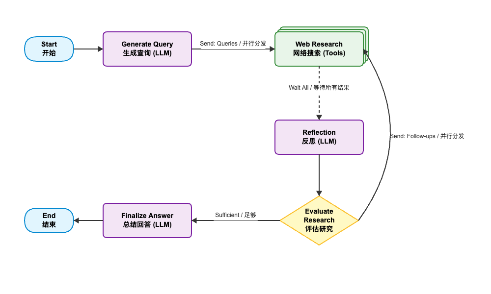

# AI Agent Deep Research 实战指南

## 前言

在 Agent 设计模式的演进中，我们已经见证了 ReAct 模式如何让 LLM 学会使用工具，Plan-and-Solve 模式如何提升复杂任务的规划能力。然而，当我们面对"分析2025年贵州茅台的投资价值"这样需要深度分析、多角度求证的复杂课题时，现有的模式往往显得力不从心。单次的搜索和总结往往只能提供浮于表面的信息，无法像人类分析师那样进行层层递进的深度挖掘。

**Deep Research（深度研究）** 模式正是为了解决这一痛点而生。它的核心理念在于**迭代式研究（Iterative Research）**。与传统的"搜索-总结"线性流程不同，Deep Research 引入了**反思（Reflection）**机制，模仿人类研究员的工作流：

1.  **广度优先（Breadth-First）**：先生成多个角度的初始查询，获取概览信息。
2.  **自我反思（Self-Reflection）**：阅读初步结果，像人类一样自问："这些信息够了吗？还缺什么细节？"
3.  **深度挖掘（Depth-First）**：针对反思中发现的**知识缺口（Knowledge Gap）**，生成具体的后续查询。
4.  **循环迭代**：重复上述过程，直到信息充足或达到预定深度。

这种模式让 Agent 从单纯的"问答机器"进化为具备批判性思维的"研究助手"，能够主动识别信息的缺失并自主补全。本文将基于 LangGraph 实现这样一个完整的深度研究 Agent。

## 一、工作流程 (Workflow)

Deep Research 的典型工作流包含以下关键节点：



1.  **Generate Query (生成查询)**: 将用户模糊的需求转化为多个具体的搜索引擎友好的查询词。
2.  **Web Research (网络研究)**: 并行执行搜索，抓取网页内容。这是一个高并发的步骤，利用 **Send** 机制分发任务。
3.  **Reflection (反思)**: 核心大脑。分析已收集的信息，判断是否满足需求。如果不满足，识别知识缺口，生成 Follow-up Queries（后续查询）。
4.  **Evaluate (评估)**: 路由节点。决定是继续下一轮搜索（进入 Web Research），还是结束研究（进入 Finalize Answer）。
5.  **Finalize Answer (输出报告)**: 综合所有轮次收集的信息，生成最终报告，并附上引用来源。

## 二、核心代码实现

我们使用 **LangGraph** 来编排这个复杂的状态机，使用 **Tavily API** 进行高质量搜索。

### 2.1 状态定义

首先定义 Agent 的"记忆"（State）。我们需要存储用户的原始问题、所有生成的查询、收集到的搜索结果、以及反思产生的知识缺口。

```typescript
// types.ts
import { Annotation } from "@langchain/langgraph";
import { BaseMessage } from "@langchain/core/messages";

export const OverallState = Annotation.Root({
  messages: Annotation<BaseMessage[]>({
    reducer: (x, y) => x.concat(y),
    default: () => [],
  }),
  // 存储所有生成的搜索查询
  search_query: Annotation<string[]>({
    reducer: (x, y) => x.concat(y),
    default: () => [],
  }),
  // 存储所有搜索结果
  web_research_result: Annotation<string[]>({
    reducer: (x, y) => x.concat(y),
    default: () => [],
  }),
  // 反思状态
  is_sufficient: Annotation<boolean>({
    reducer: (x, y) => y,
    default: () => false,
  }),
  knowledge_gap: Annotation<string>({
    reducer: (x, y) => y,
    default: () => "",
  }),
  follow_up_queries: Annotation<string[]>({
    reducer: (x, y) => y,
    default: () => [],
  }),
  // 循环控制
  research_loop_count: Annotation<number>({
    reducer: (x, y) => y,
    default: () => 0,
  }),
});
```

### 2.2 生成初始查询

Agent 的第一步不是直接搜索，而是"拆解问题"。

```typescript
// graph.ts (Generate Query Node)
async function generateQuery(state: typeof OverallState.State) {
  // ...配置与LLM初始化...
  
  const formattedPrompt = queryWriterInstructions
    .replace('{current_date}', currentDate)
    .replace('{research_topic}', researchTopic)
    .replace('{number_queries}', '3'); // 生成3个初始角度

  // 使用结构化输出保证格式
  const result = await structuredLLM.invoke(formattedPrompt);

  return {
    search_query: result.query, // 例如 ["AI 2025 趋势", "AI 医疗应用", "AI 伦理挑战"]
  };
}
```

### 2.3 并行搜索执行

为了提高效率，我们并行执行搜索。这里利用了 LangGraph 的 `Send` 机制，将每个查询分发给独立的 `web_research` 节点运行。

```typescript
// graph.ts (Conditional Edge)
function continueToWebResearch(state: typeof OverallState.State) {
  // 将每个新生成的查询转换为一个并行的搜索任务
  return state.search_query.map(
    (query, index) => new Send('web_research', { search_query: query, id: index })
  );
}

// graph.ts (Web Research Node)
async function webResearch(state: typeof WebSearchState.State) {
  // 调用 Tavily 搜索工具
  const results = await wideSearchForToolStr.invoke({ query: state.search_query });
  
  return {
    search_query: [state.search_query],
    web_research_result: [results], // 存储搜索结果
  };
}
```

### 2.4 核心：反思与知识缺口

这是 Deep Research 的灵魂。Agent 阅读所有已有的搜索结果，判断是否足够回答用户问题。

```typescript
// graph.ts (Reflection Node)
async function reflection(state: typeof OverallState.State) {
  const summaries = state.web_research_result.join('\n\n---\n\n');
  
  const formattedPrompt = reflectionInstructions
    .replace('{research_topic}', getResearchTopic(state.messages))
    .replace('{summaries}', summaries); // 注入已有知识

  // LLM 评估：是否足够？缺什么？
  const result = await structuredLLM.invoke(formattedPrompt);

  return {
    is_sufficient: result.is_sufficient,
    knowledge_gap: result.knowledge_gap, 
    follow_up_queries: result.follow_up_queries, // 生成针对性的后续查询
    research_loop_count: state.research_loop_count + 1,
  };
}
```

### 2.5 决策路由

根据反思结果决定下一步。

```typescript
// graph.ts (Evaluate Node)
function evaluateResearch(state: typeof OverallState.State) {
  // 如果信息充足 或 达到最大循环次数(防止死循环)
  if (state.is_sufficient || state.research_loop_count >= 2) {
    return 'finalize_answer';
  }
  
  // 否则，将后续查询(Follow-up Queries)再次投入搜索
  return state.follow_up_queries.map(
    (query, index) => new Send('web_research', { search_query: query, id: index })
  );
}
```

## 三、实战案例：贵州茅台分析

我们使用一个真实的运行日志，展示 Agent 如何分析 **"贵州茅台"**。

```
npx ts-node src/deep-research/index.ts "贵州茅台分析"

🚀 程序启动...

🔍 启动深度研究助手
📋 研究问题: 贵州茅台分析
⏳ 开始执行...

📡 正在调用 graph.stream...
✅ 图执行已启动，等待节点输出...


============================================================
🔧 节点: generate_query
============================================================
📝 生成的查询:
  1. 贵州茅台2025年最新业绩分析
🔍 Searching Tavily: "贵州茅台2025年业绩分析"
🔍 Searching Tavily: "2025年贵州茅台财务数据"
🔍 Searching Tavily: "贵州茅台2025年销售额"
🔍 Searching Tavily: "Kweichow Moutai 2025 performance analysis"

============================================================
🔧 节点: web_research
============================================================
🌐 网络研究已完成
Reflection result: {
  is_sufficient: false,
  knowledge_gap: 'The summary lacks details on the specifics of Kweichow Moutai’s green technology initiatives, the impact of digital platforms on their sales strategy, recent global spirits market trends affecting their international standing, and economic pressures influencing their pricing and inventory strategies.',
  follow_up_queries: [
    'What specific green technology initiatives has Kweichow Moutai implemented, and how do they contribute to their sustainable practices?',
    ...
    "How are current economic pressures influencing Kweichow Moutai's pricing and inventory strategies?"
  ]
}

============================================================
🔧 节点: reflection
============================================================
🤔 反思结果:
  - 信息是否充足: 否
  - 知识缺口: The summary lacks details on the specifics of Kweichow Moutai’s green technology initiatives, the impact of digital platforms on their sales strategy, recent global spirits market trends affecting their international standing, and economic pressures influencing their pricing and inventory strategies.
  - 后续查询:
    1. What specific green technology initiatives has Kweichow Moutai implemented, and how do they contribute to their sustainable practices?
    2. How has the integration of digital platforms like 'i茅台' impacted Kweichow Moutai’s sales strategies and customer engagement?
    3. What recent trends in the global spirits market could affect Kweichow Moutai's international performance?
    4. How are current economic pressures influencing Kweichow Moutai's pricing and inventory strategies?

🔍 Searching Tavily: "Kweichow Moutai pricing strategy under economic pressure 2025"
...

🔍 Searching Tavily: "Kweichow Moutai export challenges and opportunities 2025"

============================================================
🔧 节点: web_research
============================================================
🌐 网络研究已完成

...

============================================================
🔧 节点: web_research
============================================================
🌐 网络研究已完成
Reflection result: {
  is_sufficient: false,
  knowledge_gap: 'The summaries provide detailed financial and market insights for Kweichow Moutai in 2025, but there are unexplored areas regarding specific strategic plans and future innovations to address slow growth and changing consumer preferences at both national and international levels.',
  follow_up_queries: [
    'What strategies is Kweichow Moutai employing to counteract the slow growth in Q3 2025?',
    'How is Kweichow Moutai planning to address the weakening Chinese consumer demand?',
    'What innovations or product lines is Kweichow Moutai introducing to cater to international markets?'
  ]
}

============================================================
🔧 节点: reflection
============================================================
🤔 反思结果:
  - 信息是否充足: 否
  - 知识缺口: The summaries provide detailed financial and market insights for Kweichow Moutai in 2025, but there are unexplored areas regarding specific strategic plans and future innovations to address slow growth and changing consumer preferences at both national and international levels.
  - 后续查询:
    1. What strategies is Kweichow Moutai employing to counteract the slow growth in Q3 2025?
    2. How is Kweichow Moutai planning to address the weakening Chinese consumer demand?
    3. What innovations or product lines is Kweichow Moutai introducing to cater to international markets?

============================================================
🔧 节点: finalize_answer
============================================================

✅ 最终答案:

Kweichow Moutai, a premier Chinese liquor brand, has showcased robust financial ...
market strategies positions it strongly in the luxury liquor segment while preparing for future challenges ([source](https://www.swotandpestle.com)).

============================================================
🎉 研究完成!
============================================================
```

## 四、总结

Deep Research 模式突破了传统 Agent 浅层搜索的局限，通过模仿人类研究员"广度探索-自我反思-深度挖掘"的迭代工作流，自动化地识别并填补知识缺口，从而能够自主完成从模糊需求到高质量深度研究报告的完整闭环，特别适用于行业调研、竞品分析等需要深度洞察的复杂场景。
